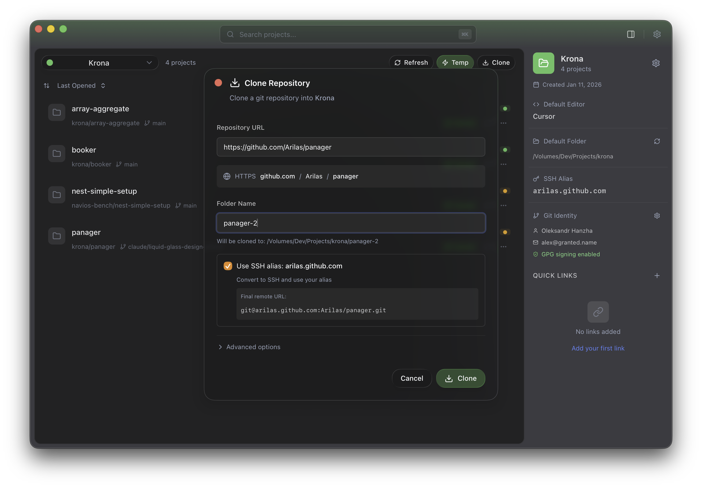
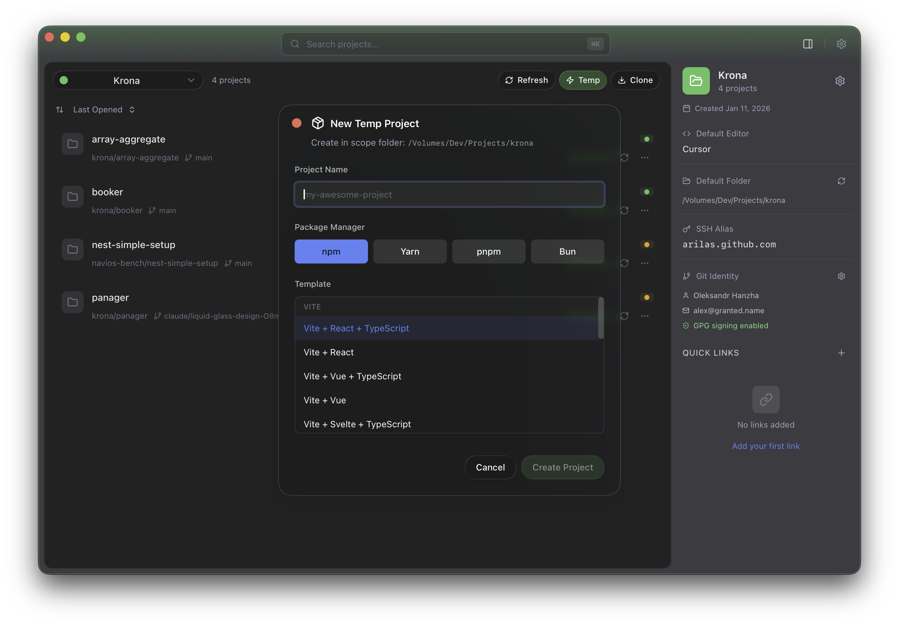
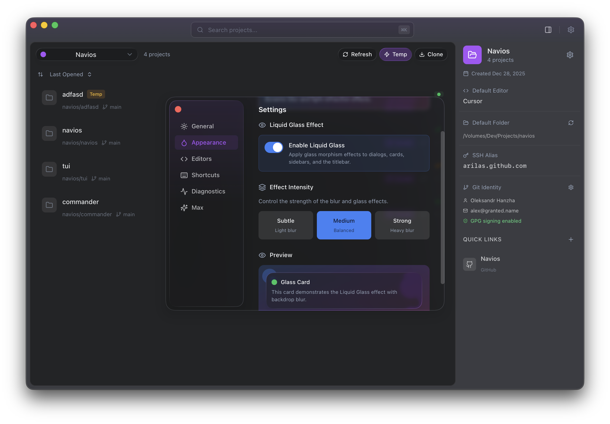
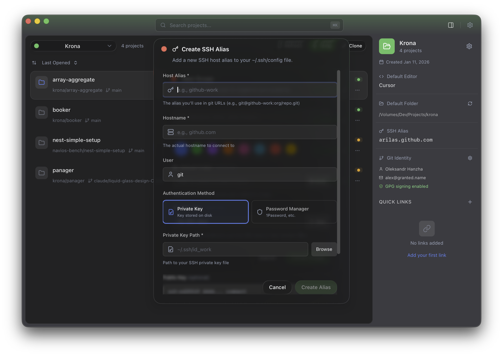
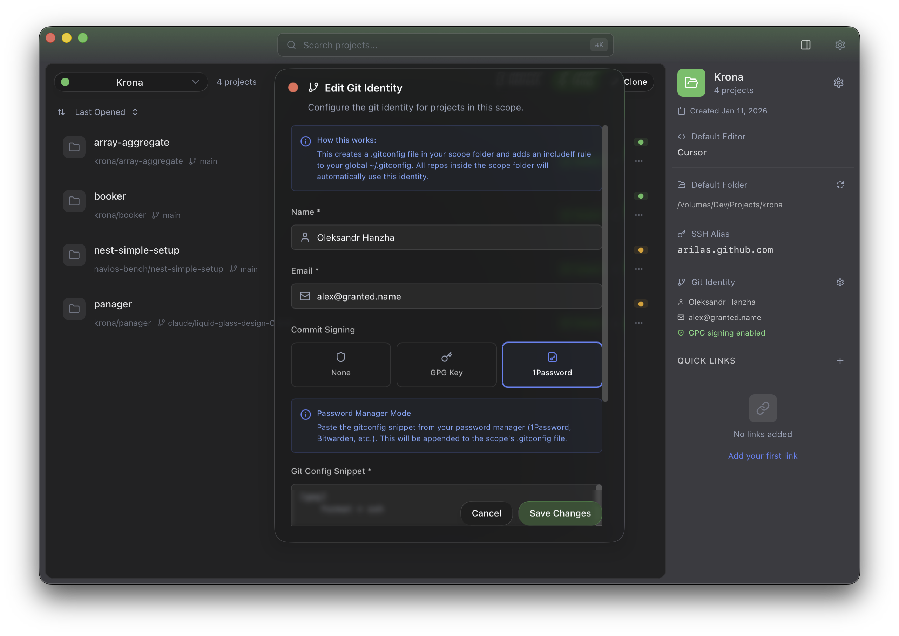
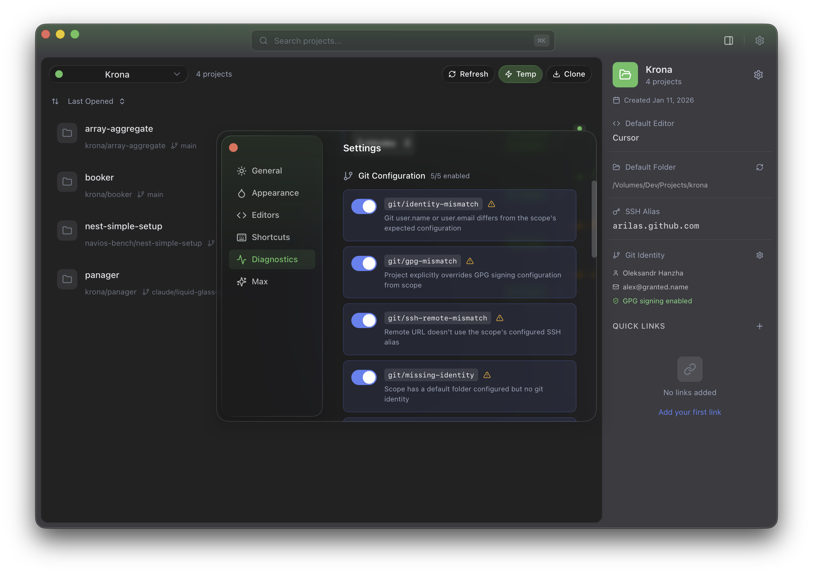

<p align="center">
  
</p>

<h1 align="center">Panager</h1>

<p align="center">
  A cross-platform project manager for developers
</p>

<p align="center">
  Organize projects across different scopes, track git status, and quickly open projects in your favorite editor.
</p>

<p align="center">
  
</p>

---

## Features

### Core Features
- **Scope-Based Organization** — Group projects into custom scopes (work, personal, clients) with unique colors and icons
- **Default Folders** — Assign a default folder to each scope; new projects are automatically organized
- **Git Integration** — Real-time git status tracking, branch info, ahead/behind status, and one-click pull/push
- **Editor Integration** — Open projects in your preferred editor with one click; auto-detects installed editors
- **Smart Search** — Filter projects by name, path, or tags with keyboard navigation
- **Command Palette** — Quick actions and project switching via `Cmd+K` (macOS) / `Ctrl+K` (Windows/Linux)
- **Drag & Drop** — Add projects by dragging folders into the app
- **Folder Scanning** — Auto-discover git repositories in a directory (handles nested repos)
- **Tags** — Flexible project categorization with custom tags and multi-tag filtering
- **Scope Links** — Quick links to GitHub, GitLab, Bitbucket, Jira, Confluence, Notion, Linear, and Slack
- **Scope Info Panel** — Toggle with `Cmd+B` to view scope details, SSH alias, git identity, and stats

### Project Management
- **Multiple Editors** — Set preferred editor per project with quick dropdown selection
- **Move Between Scopes** — Transfer projects between scopes with optional folder relocation
- **Project Sorting** — Sort by last opened, name, or date added
- **Reveal in Finder** — Open project folder in system file explorer
- **Copy Path** — Quick clipboard copy of project path
- **Last Opened Tracking** — Remember when projects were last accessed

### Clone Repository
- **One-Click Cloning** — Clone repositories directly into a scope's default folder
- **SSH Alias Support** — Automatically transform URLs to use your configured SSH aliases
- **Clone Options** — Specify branch, shallow clone for large repos
- **Progress Streaming** — Real-time clone progress with expandable detailed logs
- **Auto-Registration** — Cloned projects are automatically added to the scope

### Temp Projects
- **Framework Templates** — Create projects from 14+ templates:
  - Vite (React, Vue, Svelte with TypeScript variants)
  - Next.js (with App Router, TypeScript, Tailwind options)
  - Remix, Astro, Nuxt, SvelteKit, SolidStart
  - NestJS, Hono
- **Package Manager Selection** — Choose npm, yarn, pnpm, or bun
- **Progress Streaming** — Real-time creation progress with detailed logs
- **Auto-Cleanup** — Temp projects are marked for easy identification and cleanup
- **Scope-Aware** — Created in the scope's default folder when configured

### Max Integrations (Optional)
Enable deeper integration features per scope:

- **SSH Alias Management** — Create and manage SSH host aliases with private key configuration; automatically transform git URLs to use your aliases
- **Git Identity** — Set up per-scope git identity (name, email, GPG signing) that automatically applies to projects in the scope folder
- **Folder Warnings** — Detect projects in scope folders that aren't registered and offer to add them

### Diagnostics System
Automatic detection and alerts for configuration issues:

- **Git Issues** — Missing identity, incomplete GPG config, signing method mismatches
- **Repository Issues** — Unpushed commits, merge conflicts, diverged from remote, detached HEAD
- **Project Issues** — Projects outside configured folder, empty repositories, missing .gitignore
- **Security Issues** — Node modules committed, .env files tracked, insecure remotes
- **SSH Mismatches** — Alerts when remote URLs don't use the scope's configured SSH alias
- **Auto-Scanning** — Background scanning with configurable interval
- **Dismissible** — Dismiss individual issues to reduce noise

### Appearance
- **Theme** — Light, dark, or follow system preference
- **Liquid Glass Effect** — macOS vibrancy effects with configurable intensity (subtle, medium, strong)
- **Native Feel** — Platform-specific rendering with native titlebar

### Background Services
- **Folder Scanner** — Auto-discovers new git repositories in scope default folders
- **Git Status Cache** — Periodic auto-refresh with configurable interval
- **Diagnostics Scanner** — Automatic issue detection and reporting

## Screenshots

| Clone Repository | New Temp Project | Settings |
|------------------|------------------|----------|
|  |  |  |

| SSH Alias | Git Identity | Diagnostics |
|-----------|--------------|-------------|
|  |  |  |

## Tech Stack

- **Frontend:** React 19, TypeScript, Vite, Tailwind CSS
- **Backend:** Tauri 2, Rust
- **Database:** SQLite (embedded)
- **UI Components:** Radix UI, Lucide React
- **State Management:** Zustand

## Prerequisites

- [Node.js](https://nodejs.org/) (v18+)
- [Rust](https://www.rust-lang.org/tools/install)
- [Tauri CLI](https://tauri.app/start/prerequisites/)

## Development

```bash
# Install dependencies
npm install

# Run in development mode
npm run tauri dev
```

## Building

```bash
# Build for production
npm run tauri build
```

Build artifacts will be in `src-tauri/target/release/bundle/`.

## Keyboard Shortcuts

| Shortcut | Action |
|----------|--------|
| `Cmd+K` / `Ctrl+K` | Open command palette |
| `Cmd+B` / `Ctrl+B` | Toggle scope info panel |
| `Cmd+F` / `Ctrl+F` | Focus search |
| `Cmd+,` | Open settings |
| `Cmd+N` | New project |
| `↑` / `↓` | Navigate projects |
| `Enter` | Open selected project |
| `Escape` | Clear search / deselect |
| `Cmd+Shift+O` | Open app (global hotkey) |

## License

MIT
