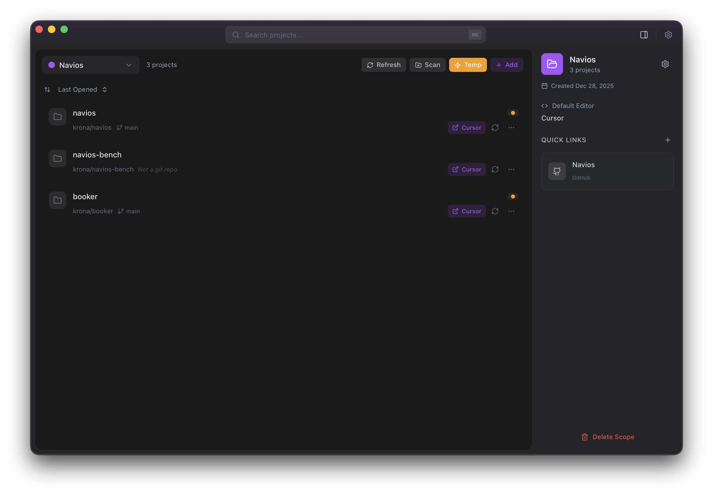

<p align="center">
  
</p>

<h1 align="center">Panager</h1>

<p align="center">
  A cross-platform project manager for developers
</p>

<p align="center">
  Organize projects across different scopes, track git status, and quickly open projects in your favorite editor.
</p>

<p align="center">
  
</p>

---

## Features

- **Scope-Based Organization** — Group projects into custom scopes (work, personal, clients) with unique colors and icons
- **Git Integration** — Real-time git status tracking, branch info, ahead/behind status, and one-click pull/push
- **Editor Integration** — Open projects in your preferred editor with one click; auto-detects installed editors
- **Smart Search** — Filter projects by name, path, or tags with keyboard navigation
- **Command Palette** — Quick actions via `Cmd+K` (macOS) / `Ctrl+K` (Windows/Linux)
- **Drag & Drop** — Add projects by dragging folders into the app
- **Folder Scanning** — Auto-discover git repositories in a directory
- **Tags** — Flexible project categorization with custom tags
- **Scope Links** — Add quick links to related resources (GitHub, Jira, Notion, Slack)
- **Native Feel** — macOS vibrancy effects, native titlebar, dark/light mode support

## Tech Stack

- **Frontend:** React 19, TypeScript, Vite, Tailwind CSS
- **Backend:** Tauri 2, Rust
- **Database:** SQLite (embedded)
- **UI Components:** Radix UI, Lucide React
- **State Management:** Zustand

## Prerequisites

- [Node.js](https://nodejs.org/) (v18+)
- [Rust](https://www.rust-lang.org/tools/install)
- [Tauri CLI](https://tauri.app/start/prerequisites/)

## Development

```bash
# Install dependencies
npm install

# Run in development mode
npm run tauri dev
```

## Building

```bash
# Build for production
npm run tauri build
```

Build artifacts will be in `src-tauri/target/release/bundle/`.

## Keyboard Shortcuts

| Shortcut | Action |
|----------|--------|
| `Cmd+K` | Open command palette |
| `Cmd+,` | Open settings |
| `Cmd+N` | New project |
| `↑` / `↓` | Navigate projects |
| `Enter` | Open selected project |
| `Cmd+Shift+O` | Open app (global) |

## License

MIT
